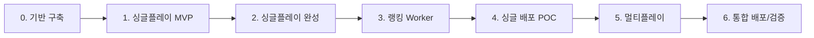

# 포켓몬 마스터

1~9세대(1~1025번) 포켓몬 이미지를 보고 이름을 맞추는 퀴즈 웹게임입니다.

## 기능

- **싱글플레이**: 10단계 × 5문제 (50문제), TOP10 랭킹 등록
- **멀티플레이**: 4명 자동 매칭, 실시간 정답 경쟁 (Cloudflare Durable Objects)

## 기술 스택

- React + Vite (GitHub Pages)
- Cloudflare Workers (랭킹 등록 프록시)
- Cloudflare Durable Objects + WebSocket (멀티플레이)

## 로컬 실행

```bash
npm install
npm run fetch-data   # PokeAPI에서 데이터/이미지 수집 (1회)
cp public/data/pokemon.json worker/data/pokemon.json
cp .env.example .env   # Worker URL 등 설정
npm run dev
```

## 배포

### GitHub Pages (자동)

`main` 브랜치 push 시 `.github/workflows/deploy-pages.yml` 이 자동 실행됩니다.

1. GitHub 저장소 **Settings → Pages → Build and deployment → Source: GitHub Actions**
2. **Settings → Secrets and variables → Actions → Variables** 에 아래 추가:

| Variable | 예시 | 설명 |
|----------|------|------|
| `VITE_WORKER_URL` | `https://pokemon-master-worker.xxxx.workers.dev` | 랭킹 등록/조회 Worker URL |
| `VITE_RANKINGS_RAW_URL` | `https://raw.githubusercontent.com/{owner}/{repo}/main/data/rankings.json` | 랭킹 조회 fallback (선택) |
| `VITE_BASE` | `/repo-name/` | base 경로 override (선택, 미설정 시 자동) |

3. `main` 브랜치 push → Actions 탭에서 **Deploy GitHub Pages** 워크플로 확인

### Cloudflare Worker

**수동 배포**
```bash
cd worker
npm install
wrangler secret put GITHUB_TOKEN    # rankings.json write 권한 PAT
wrangler secret put GITHUB_OWNER
wrangler secret put GITHUB_REPO
wrangler deploy
```

**GitHub Actions 자동 배포** (`.github/workflows/deploy-worker.yml`)

| Secret | 설명 |
|--------|------|
| `CLOUDFLARE_API_TOKEN` | Cloudflare API 토큰 (Workers Edit) |
| `CLOUDFLARE_ACCOUNT_ID` | Cloudflare 계정 ID |
| `WORKER_GITHUB_TOKEN` | GitHub PAT (repo scope, rankings.json write) |

Worker 배포 후 Repository Variable `VITE_WORKER_URL`에 Worker URL을 설정하세요.

## 폴더 구조

```
/public/data/          # pokemon.json + images (빌드에 포함)
/data/                 # rankings.json, korean_names.json
/scripts/              # fetch_pokemon_data.js
/worker/               # Cloudflare Worker + Durable Objects
/src/                  # React 프론트엔드
```

## 등급 (싱글플레이)

| 점수 | 등급 |
|------|------|
| 47점 이상 | 포켓몬 마스터 |
| 33~46점 | 포켓몬 트레이너 |
| 17~32점 | 지식인 |
| 17점 미만 | 일반인 |

## 멀티플레이 점수

문제별 정답 순서: 1등 4점 / 2등 3점 / 3등 2점 / 4등 1점 / 오답 0점

## 데이터 출처

- [PokeAPI](https://pokeapi.co/)
- [PokeAPI Sprites](https://github.com/PokeAPI/sprites)

## 개발 구현 단계

POC(Proof of Concept) 관점에서 점진적으로 가치를 검증할 수 있도록 개발 단계를 구분합니다.
`0단계(기반) → 싱글플레이 MVP → 랭킹/배포 → 멀티플레이 → 통합 마무리` 순으로 진행합니다.



### 0단계: 프로젝트 기반 및 데이터 파이프라인

**목표:** 로컬에서 게임을 돌릴 수 있는 최소 환경과 포켓몬 데이터 확보

| 작업 | 산출물 |
|------|--------|
| Vite + React 프로젝트 초기화 | `/src` 기본 구조 |
| 폴더 구조 생성 | `/public/data`, `/data`, `/scripts`, `/worker` |
| PokeAPI 데이터 수집 스크립트 | `/scripts/fetch_pokemon_data.js` |
| 1~1025번 데이터 + 이미지 저장 | `/public/data/pokemon.json`, 이미지 파일 |
| 한글 이름 매핑 | `/data/korean_names.json` |
| 랭킹 초기 파일 | `/data/rankings.json` (빈 배열) |
| `.env.example` 작성 | Worker URL 등 placeholder |

- **완료 기준:** `npm run fetch-data` 실행 후 `pokemon.json`과 이미지가 로컬에서 로드 가능
- **POC 검증 포인트:** 데이터 품질(한글명, 이미지 누락 여부) 확인

### 1단계: 싱글플레이 MVP (로컬 전용)

**목표:** 브라우저에서 "이미지 보고 이름 맞추기" 핵심 루프 검증

| 작업 | 내용 |
|------|------|
| 게임 화면 UI | 포켓몬 이미지, 4지선다 객관식 |
| 문제 출제 로직 | 1~1025번 중 랜덤, 중복 없이 50문제 |
| 10단계 × 5문제 진행 | 단계별 진행 표시, 다음 문제 전환 |
| 정답/오답 피드백 | 즉시 결과 표시 |
| 로컬 점수 집계 | 50문제 종료 후 총점 |

- **완료 기준:** 백엔드 없이 로컬 JSON만으로 50문제 퀴즈 완주 가능
- **POC 검증 포인트:** UX(문제 난이도, 선택지 품질, 진행감)가 재미있는지 확인

### 2단계: 싱글플레이 완성 (점수·등급·결과 화면)

**목표:** 싱글플레이 규칙을 프론트만으로 완성

| 작업 | 내용 |
|------|------|
| 점수 규칙 적용 | 정답 채점 방식 확정 |
| 등급 표시 | 28+ 마스터 / 20~27 트레이너 / 10~19 지식인 / 10 미만 일반인 |
| 시작·결과·재시작 화면 | 타이틀, 최종 점수, 등급, 다시하기 |
| 닉네임 입력 UI(선택) | 랭킹 등록용 이름 입력 필드 준비 |

- **완료 기준:** 50문제 종료 → 등급 판정 → 재시작까지 한 사이클 완료
- **POC 검증 포인트:** 등급 기준 적절성, 결과 화면의 재플레이 유도

### 3단계: Cloudflare Worker — 랭킹 API

**목표:** TOP10 랭킹 등록/조회 백엔드 구현 (GitHub 저장소 연동)

| 작업 | 내용 |
|------|------|
| Worker 프로젝트 설정 | `/worker`, wrangler 설정 |
| GitHub API 연동 | `rankings.json` read/write (secret: token, owner, repo) |
| API 엔드포인트 | `GET /rankings`, `POST /rankings` (닉네임, 점수) |
| TOP10 유지 로직 | 점수 기준 정렬, 상위 10명만 저장 |
| CORS 설정 | GitHub Pages 도메인 허용 |
| 로컬 Worker 테스트 | `wrangler dev`로 프론트 연동 |

- **완료 기준:** 로컬 프론트에서 Worker URL로 랭킹 조회·등록 성공
- **POC 검증 포인트:** 동시 등록 시 데이터 깨짐 없이 TOP10 유지되는지

### 4단계: 싱글플레이 배포 POC (GitHub Pages)

**목표:** 싱글플레이 + 랭킹만으로 첫 번째 공개 POC 달성

| 작업 | 내용 |
|------|------|
| GitHub Actions 워크플로우 | `main` push → GitHub Pages 자동 배포 |
| Repository Variables | `VITE_WORKER_URL`, `VITE_RANKINGS_RAW_URL` |
| Worker 배포 | `wrangler deploy` + secret 설정 |
| 프론트 랭킹 연동 | 게임 종료 후 TOP10 등록/표시 |
| README 절차 검증 | 문서대로 clone → fetch-data → dev → deploy 재현 |

- **완료 기준:** 공개 URL에서 싱글플레이 50문제 + TOP10 랭킹 동작
- **POC 검증 포인트:** **1차 POC 완료** — 싱글 모드만 공유해도 가치 검증 가능

### 5단계: 멀티플레이 (Durable Objects + WebSocket)

**목표:** 4인 실시간 매칭 및 점수 규칙 적용

| 작업 | 내용 |
|------|------|
| Durable Object 설계 | 매치룸 1개 = DO 1개 |
| WebSocket 연결 | 클라이언트 ↔ Worker ↔ DO |
| 4명 자동 매칭 큐 | 대기 → 4명 모이면 방 생성 |
| 동시 문제 출제 | 같은 포켓몬 이미지, 동시 타이머 |
| 실시간 정답 처리 | 정답 순서 기록 (1등 4점 / 2등 3점 / 3등 2점 / 4등 1점 / 오답 0점) |
| 멀티 UI | 대기실, 문제 화면, 라운드 결과, 최종 순위 |
| 환경 변수 | `VITE_WS_URL` 설정 |

- **완료 기준:** 4명(또는 테스트용 2~4 탭)으로 한 판 완주
- **POC 검증 포인트:** WebSocket 지연, 동시 정답 처리, 매칭 대기 UX
- **리스크:** Durable Objects + WebSocket은 복잡도가 크므로 4단계 POC 이후 착수 권장

### 6단계: 통합 배포 및 POC 마무리

**목표:** 싱글 + 멀티 전체 스택을 문서와 동일하게 운영

| 작업 | 내용 |
|------|------|
| Worker + DO 통합 배포 | wrangler routes, DO 바인딩 확인 |
| GitHub Pages Variables | `VITE_WS_URL` 추가 |
| E2E 시나리오 테스트 | 싱글 50문제, 랭킹, 멀티 1판 |
| 에러/엣지 케이스 | 연결 끊김, 매칭 타임아웃, Worker 오류 시 UX |
| 간단 모니터링(선택) | Cloudflare 대시보드, Worker 로그 |

- **완료 기준:** README의 기능·배포·로컬 실행 절차가 모두 재현 가능

### 단계별 우선순위 요약

| 단계 | 범위 | POC 의미 | 예상 난이도 |
|------|------|----------|-------------|
| 0 | 데이터·스캐폴드 | 없으면 시작 불가 | 낮음 |
| 1~2 | 싱글플레이 (로컬) | **핵심 게임성 검증** | 중간 |
| 3~4 | 랭킹 + GitHub Pages | **1차 공개 POC** | 중간 |
| 5~6 | 멀티플레이 + 통합 | **풀 스택 POC** | 높음 |

> **권장 진행 방식**
> 1. 4단계까지를 "핵심 POC"로 두고, 멀티는 별도 마일스톤으로 분리
> 2. 각 단계마다 완료 기준(Definition of Done)을 체크한 뒤 다음 단계 진행
> 3. 1~2단계에서는 Worker/Cloudflare 없이 프론트 + 로컬 JSON만으로 빠르게 UX 검증
